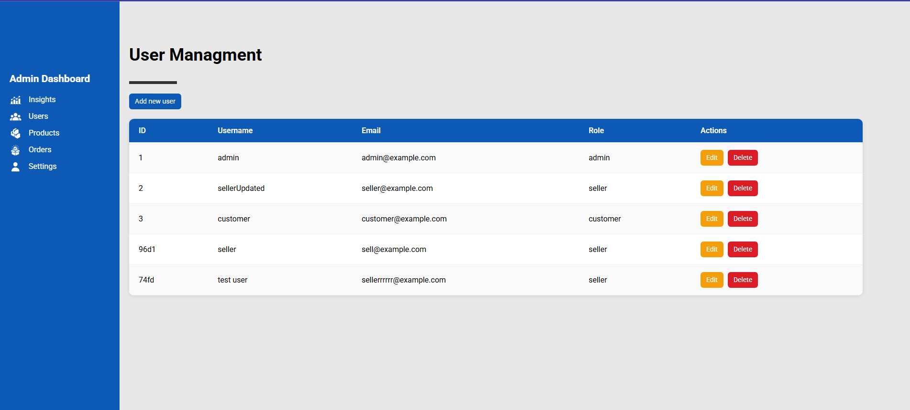
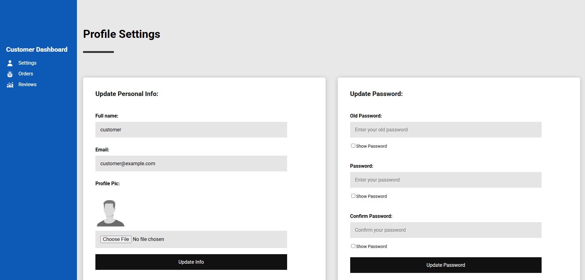
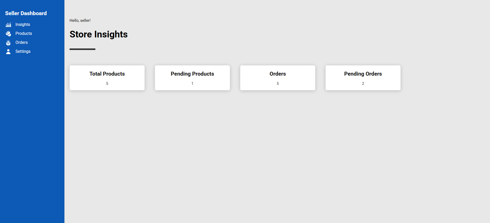

# 🛍️ Vanilla JavaScript E-Commerce Website

This is a browser-based eCommerce application built using **HTML**, **CSS**, and **JavaScript** (Vanilla JS only, no frameworks). It simulates a functional shopping platform with separate interfaces for **Customers**, **Sellers**, and **Admins** — all supporting core **CRUD operations** for users, products, and orders.

## 👨‍💻 Built By

- Bahaa
- Eslam

# E-commerce Website

## 🌟 Website Features

### 🛡️ **Role-Based Access Control System**
- Three distinct user roles, each with specific permissions.
- Granular access control for every feature based on user role.

### 🔐 **Authentication System**
- **User Registration & Login**: Secure sign-up and login process.
- **Role-Based Redirection**: Directs users to appropriate dashboards based on their roles after login.
- **Profile Management**: Allows users to edit their personal information.
- **Password Encryption**: All user passwords are securely hashed and encrypted using a robust encryption method, ensuring safe storage and retrieval during login.

### 👨‍💼 **Admin Features**
- **User Management Dashboard**
  - Create, edit, and delete user accounts.
  - Modify user roles and permissions.
- **Product Oversight**
  - Approve/reject product submissions from sellers.
  - Edit or remove any product listed across the platform.
- **Order Supervision**
  - View and manage all orders across the platform.

### 🛒 **Customer Features**
- **Personal Account**
  - Register an account and manage profile details.
  - Track order history and status.
- **Shopping Experience**
  - Product search to narrow down choices.
  - Shopping cart system to manage added items.
  - Checkout process to complete purchases.
- **Community Features**
  - Leave product reviews and ratings to help other customers for the purchases products.

### 🏪 **Seller Features**
- **Product Management**
  - Add new products with detailed descriptions and images.
  - Edit or remove existing product listings.
- **Sales Dashboard**
  - View order history and manage sales.
  - Update order statuses (e.g. , shipped, delivered).

### 👤 **Anonymous User Features**
- Browse the product catalog without requiring an account.
- View detailed product information.
- Use search functionality to find products.
- Prompts for registration to access full features and make purchases.

### 🛍️ **Core E-commerce Functionality**
- Fully functional **shopping cart system** for adding/removing items.
- **Order processing workflow** that includes order creation, tracking, and status updates.
- **Responsive design** that ensures seamless experience across all devices (mobile, tablet, desktop).

### ⚙️ **Technical Implementation**
- Frontend built with **pure JavaScript** (ES5/ES6+) – no external frameworks.
- **Mock database** using `db.json` to simulate backend functionality with **json-server**.
- Semantic **HTML5** and **CSS3** for clean and structured code.
- Fully functional without external dependencies.
